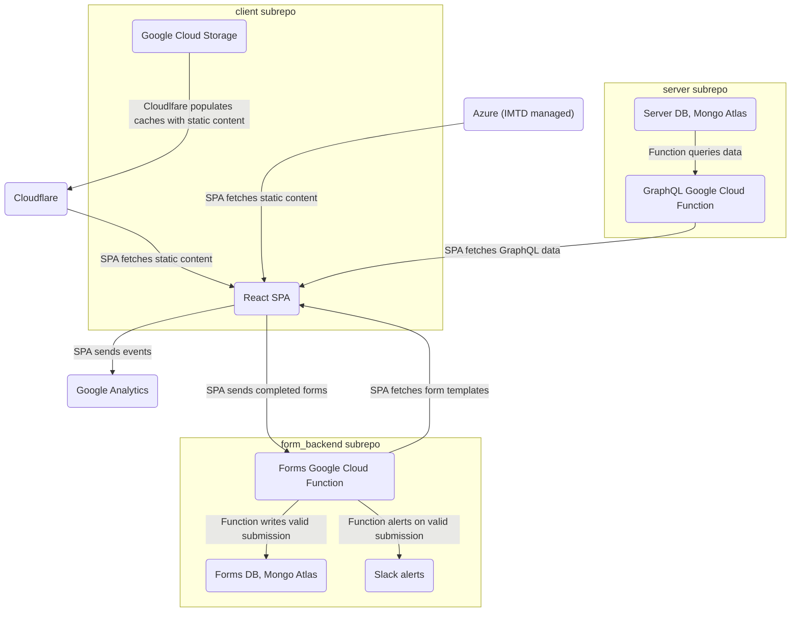
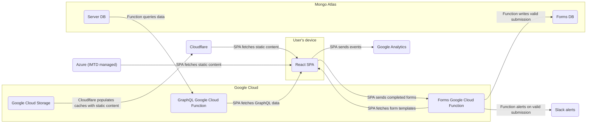
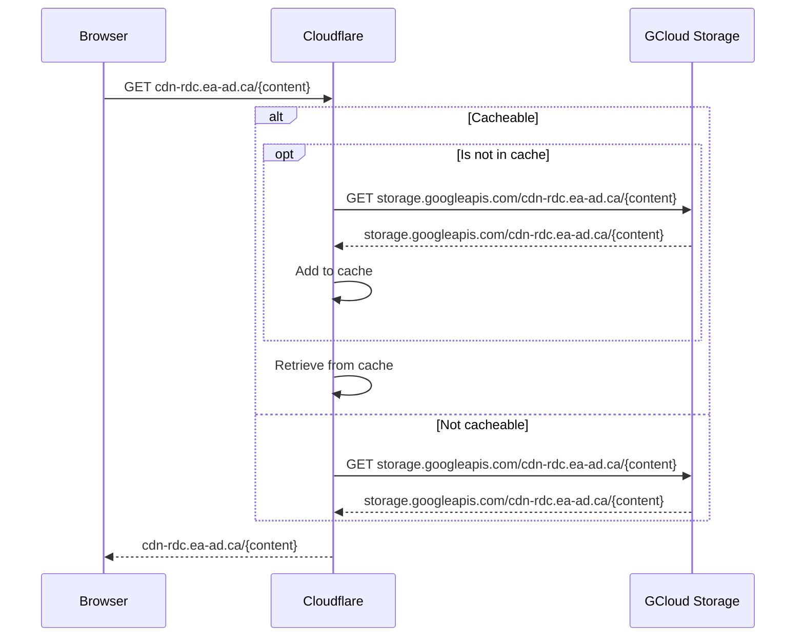
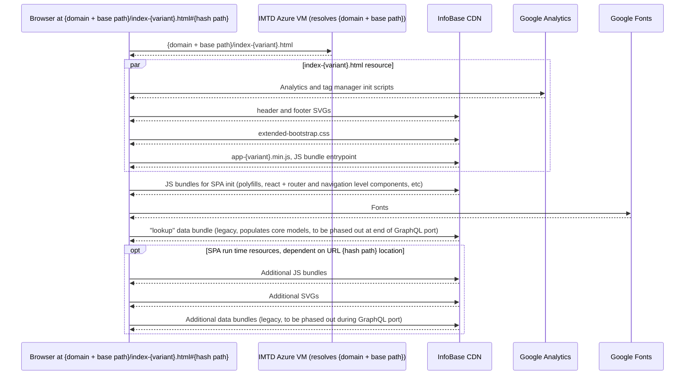
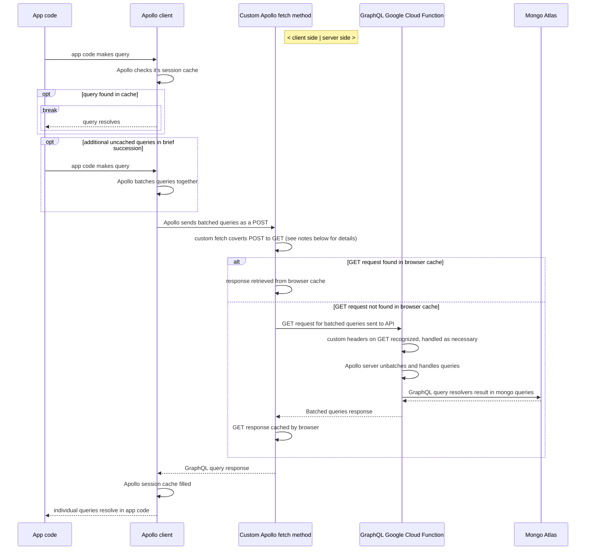
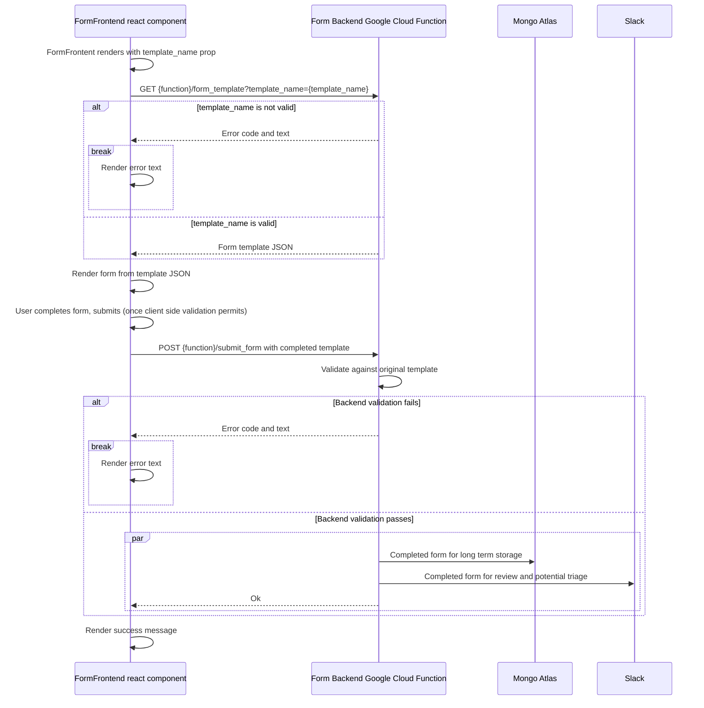

# GC InfoBase Infrastructure

This markdown file includes [mermaid](mermaid-js.github.io/mermaid) diagrams. GitHub's markdown viewer will render these. For local viewing/editing, install the VS Code mermaid preview and syntax highlighting extensions.

<!-- toc -->

- [High-level Architecture](#high-level-architecture)
  - [Grouped by subrepo](#grouped-by-subrepo)
  - [Grouped by environment](#grouped-by-environment)
- [Component Architectures](#component-architectures)
  - [Static content](#static-content)
    - [InfoBase CDN](#infobase-cdn)
    - [Sketch of typical static content loading sequence](#sketch-of-typical-static-content-loading-sequence)
  - [GraphQL API](#graphql-api)
  - [Form Backend API](#form-backend-api)

<!-- tocstop -->

## High-level Architecture

Notes:

- Arrows point in the direction data is flowing
- These high-level diagrams are for reference, they make certain simplifications and are light on explanations. See [Detailed Component Architectures](#detailed-component-architectures) for more granular per-component information
- These diagrams represent the production infrastructure. At the level of these diagrams, the only difference for "dev link" builds is that Azure plays no part in them and all static content comes from Google Cloud.
  - There are other important differences between prod and dev links, but they're all more granular than these high-level sections cover. The largest difference worth also mentioning here is that, currently, dev links _do not_ deploy their own form backend infrastructure, they just speak to the production forms API directly.

### Grouped by subrepo

Note the three outliers above. The static content hosted in IMTD's Azure environment, Cloudflare, and Google Analytics are all coupled to the "client subrepo", but have been left outside the grouping itself. I've done this as they all, to different extents, have configuration rules and management processes that exist outside of the repo (where as everything else is largely managed via committed scripts, configuration files, etc).

For legacy reasons the production site entry points, a set of four index-{variant}.html files, are hosted on infrastructure within the TBS IMTD Azure environment. Bureaucracy, emails, and meetings are required to touch these files, so unless it becomes necessary do not plan to change their content. I'll cover the role played by the entry point index files more [below](#static-content).

Cloudflare is simpler, it's sat between the client and the majority of the static content without issue for years. I'm highlighting it as there are certain caching configuration rules set via the management dashboard that don't appear in the repo. To understand what is and isn't cached by cloudflare (as part of our larger cache busting strategy) you'll need to get on that dashboard.

Viewing the Google Analytics data and making certain configuration changes requies [dashboard](analytics.google.com) access. Historically, as the production site is a page belonging to a domain (www.tbs-sct.canada.ca) which we do not control, our site owner status on Google Analytics had to be delegated by the recognized owners (SCMA, TBS). Additionally, the run-time analytics initialization is hard-coded in the index files hosted in the Azure environemnt. This, plus the tedious nature of extracting and reporting on data once it's in there, makes this a beast on its own and something I recommend [ultimately moving away from](https://github.com/TBS-EACPD/infobase/issues/1446).

### Grouped by environment

## Component Architectures

### Static content

#### InfoBase CDN

Our CDN domain is resolved by Cloudflare which proxies requests to the corresponding GCloud storage. This gives us:

- distributed caching; potential speed boost and takes load off the cloud storage (performance and cost bonus)
- fine grained caching rules; see configuration in the Cloudflare dashboard
- programatic cache resets; see selective Cloudflare cache clearing step in the deploy scripts
- easy and free HTTPS; Google storage itself only handles HTTP. Should we be concerned that the HTTPS is not end-to-end?
  - Secrecy is not a concern, all data from the CDN is public
  - privacy? Guess I don't actually know if Cloudflare includes initial requestor information when populating it's own cache, hm
  - integrity is still provided for the leg of the trip between cloudflare and the client, which covers the regional/local network boxes. What threat actors will be in a hop between Google and Cloudflare _and_ be willing to risk that access doing anything that threatens integrity? Well, maybe certain network-isolated state actors, hm

#### Sketch of typical static content loading sequence

Notes:

- see the `client/build_code` webpack configuration for more on the JS bundles. Note that they include CSS and text content (from yaml files) as well
- legacy "data bundles" come from two scripts in `client/build_code`, `copy_static_assets.js` and `write_footnote_bundles.js`
- `index-{variant}.html` files are not refreshed as part of the standard deploy, due to their legacy management outside of our CDN (in the production case). As a result, the resources directly requested from the html entry file are hardcoded too
  - `app-{variant}.min.js` must never be cached. It is the entry to the deploy-specific bundle . In practice it _is_ cached at the cloudflare level for performance; cached versions are flushed via the cloudflare API at deploy-time
  - other hardcoded index html resources may have relatively short client TTLs for performance, but are also flushed from cloudflare during deploys. Tradeoff that changes to them will not immediately propogate to all users
- `app-{variant}.min.js` needs to be as minimal as possible, it should only start the initial loading spinner and then kick off additional loading of the run time bundles. This gets the spinner going asap and makes up for the limited caching for this file

### GraphQL API (+ batching and caching details)

Lots of implementation details surfaced in this one, but I'm making sure to cover them as they may have future maintenance implications and are worth being aware of.

Notes:

- outside of the custom fetch, this is mostly a pretty straight forward Apollo GraphQL use case. With respect to the custom fetch layer:
  - the end goal is making queries as GETs to leverage native HTTP caching. We can do this for all queries becase a) we never make mutation queries and b) the app data in Mongo Atlas is only modified at deploy-time. Deploying the app creates a new cloud function, with a new URL, busting the browser cache in the process
  - it is notably at odds with Apollo batching; a call may need to be made at some point to drop either batching or the GET requests
    - Apollo only allows batching when configured for POST requests, although converting to a GET at the fetch level and reverting that on the server side before handling it has no problem
    - exactly which queries are batched togeth _can_ be effected by client side performance/timing, two visits to the site might result in different batch contents, which will result in misses against previously cached responses
  - I've kicked the ball down the road on picking one over the other; until more of the app migrates to GraphQL we won't have a full picture on what is called for
    - if most routes send lots of small queries than batching might be best; provided we can set up the apollo cache to persist to browser storage or something between sessions
    - if there aren't too many individual queries shooting off at once, HTTP caching is more reliable than alternatives. We could even consider altering the infrastrucutre to gain a static address for our prod API and fronting it through a service like cloudflare, in which case the GET responses (with approrpaite cache busting controls) could get very nice distributed caching
- excluded from the diagram, but GraphQL resolvers that make mongo queries likely make use of data loaders internally as an additional caching layer. As the cloud functions should be considered ephemeral, this is more about queries that may revisit the same

### Form Backend API

Notes:

- the client side (via the FormFrontend component) is responsible for the forms UI. This creates a pretty strong coupling between it and the whole form_backend subrepo, which is important to maintain. Moving responsibility for rendering the forms to the service itself is an option to get this a bit better organized but not very high priority. This whole thing was always a minimum-effort side project
- the client side validation is mainly for required and pair-required (e.g. a text input that's only required if yes anserwed on related yes/no radio) inputs
- server side validation re-asserts the required fields and verifies response types/enum values. Outside of coding errors/desyncs with the frontend, this should always pass. It's primary purpose is to discard any (theoretical) direct garbage submissions spammed at the API
