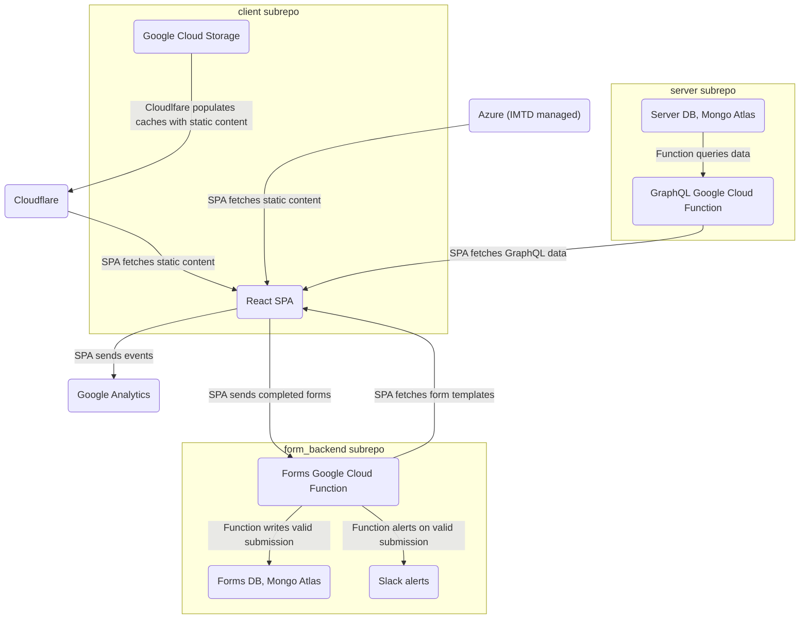
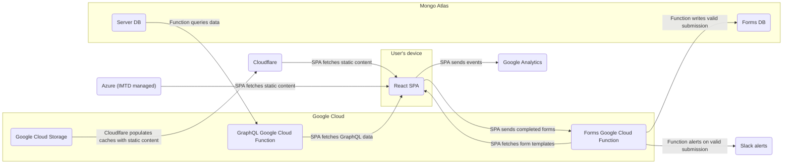
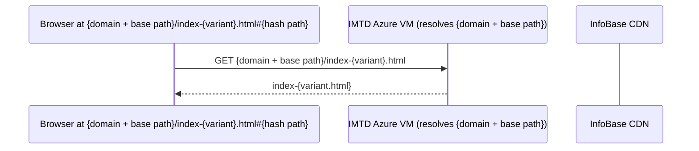
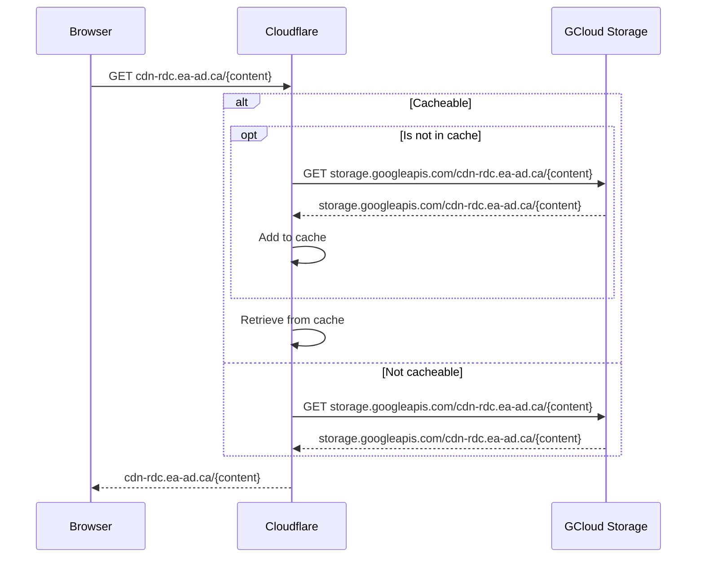

# GC InfoBase Infrastructure

This markdown file includes [mermaid](mermaid-js.github.io/mermaid) diagrams. GitHub's markdown viewer will render these. For local viewing/editing, install the VS Code mermaid preview and syntax highlighting extensions.

## High-level Architecture

Notes:

- Arrows point in the direction data is flowing
- These high-level diagrams are for reference, they make certain simplifications and are light on explanations. See [Detailed Component Architectures](#detailed-component-architectures) for more granular per-component information
- These diagrams represent the production infrastructure. At the level of these diagrams, the only difference for "dev link" builds is that Azure plays no part in them and all static content comes from Google Cloud.
  - There are other important differences between prod and dev links, but they're all more granular than these high-level sections cover. The largest difference worth also mentioning here is that, currently, dev links _do not_ deploy their own form backend infrastructure, they just speak to the production forms API directly.

### Grouped by subrepo

Note the three outliers above. The static content hosted in IMTD's Azure environment, Cloudflare, and Google Analytics are all coupled to the "client subrepo", but have been left outside the grouping itself. I've done this as they all, to different extents, have configuration rules and management processes that exist outside of the repo (where as everything else is largely managed via committed scripts, configuration files, etc).

For legacy reasons the production site entry points, a set of four index-{variant}.html files, are hosted on infrastructure within the TBS IMTD Azure environment. Bureaucracy, emails, and meetings are required to touch these files, so unless it becomes necessary do not plan to change their content. I'll cover the role played by the entry point index files more [below](#static-content).

Cloudflare is simpler, it's sat between the client and the majority of the static content without issue for years. I'm highlighting it as there are certain caching configuration rules set via the management dashboard that don't appear in the repo. To understand what is and isn't cached by cloudflare (as part of our larger cache busting strategy) you'll need to get on that dashboard.

Viewing the Google Analytics data and making certain configuration changes requies [dashboard](analytics.google.com) access. Historically, as the production site is a page belonging to a domain (www.tbs-sct.canada.ca) which we do not control, our site owner status on Google Analytics had to be delegated by the recognized owners (SCMA, TBS). Additionally, the run-time analytics initialization is hard-coded in the index files hosted in the Azure environemnt. This, plus the tedious nature of extracting and reporting on data once it's in there, makes this a beast on its own and something I recommend [ultimately moving away from](https://github.com/TBS-EACPD/infobase/issues/1446).

### Grouped by environment

## Detailed Component Architectures

### Static content

#### Initial load sketch

#### InfoBase CDN

Our CDN domain is resolved by Cloudflare which proxies requests to the corresponding GCloud storage. This gives us:

- distributed caching; potential speed boost and takes load off the cloud storage (performance and cost bonus)
- fine grained caching rules; see configuration in the Cloudflare dashboard
- programatic cache resets; see selective Cloudflare cache clearing step in the deploy scripts
- easy and free HTTPS; Google storage itself only handles HTTP. Should we be concerned that the HTTPS is not end-to-end?
  - Secrecy is not a concern, all data from the CDN is public
  - privacy? Guess I don't actually know if Cloudflare includes initial requestor information when populating it's own cache, hm
  - integrity is still provided for the leg of the trip between cloudflare and the client, which covers the regional/local network boxes. What threat actors will be in a hop between Google and Cloudflare _and_ be willing to risk that access doing anything that threatens integrity? Well, maybe certain network-isolated state actors, hm

### GraphQL API

### Form Backend API
